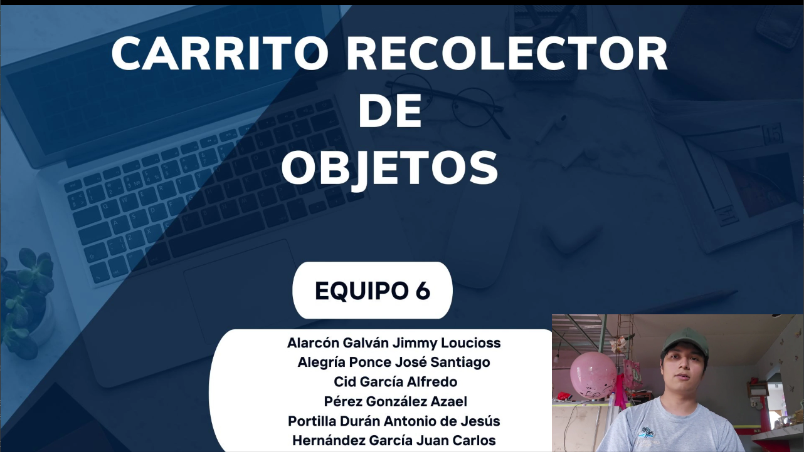

# Evidencia en Video | Etapa 4 (Final)

Se adjunta un video demostrando el proceso, conexiones y funcionamiento del proyecto:

<pre>
+-----------------------------------------------------------------------------------------+
|                           ARQUITECTURA DEL SISTEMA: FPGA-SORTER                         |
+-----------------------------------------------------------------------------------------+

   [ BLOQUE DE ENTRADAS ]               [ BLOQUE DE PROCESAMIENTO ]            [ BLOQUE DE SALIDAS ]
                                   
 +-----------------------+             +---------------------------+             +-----------------------+
 | Regleta IR (Línea)    |====(Bus)====> Módulo Seguidor de Línea  |====(PWM)====> Puente H (TB6612)     |
 +-----------------------+             |                           |             +-----------+-----------+
                                       |                           |                         | (Potencia)
 +-----------------------+             |                           |             +-----------v-----------+
 | Sensor Color TCS3200  |---(Freq)--->| Analizador de Frecuencia  |             | 2x Motorreductores DC |
 +-----------------------+             | (Decodificador de Color)  |             +-----------------------+
                                       |                           |
 +-----------------------+             | +-----------------------+ |             +-----------------------+
 | Sensor IR (FC-51)     |---(Pulso)-->| | Máquina de Estados    | |---(PWM)====>| Servomotor SG90       |
 | (Presencia de objeto) |             | | Central (FSM)         | |             | (Compuerta selectora) |
 +-----------------------+             | +-----------------------+ |             +-----------------------+
                                       |                           |
                                       |                           |             +-----------------------+
                                       | Módulo UART (Serial Tx)   |---(Tx)----->| Módulo Bluetooth      |
                                       +---------------------------+             | (HC-05)               |
                                                  (FPGA)                         +-----------+-----------+
                                                                                             |
                                                                                       (Inalámbrico)
                                                                                             |
                                                                                 +-----------v-----------+
                                                                                 | PC (Laptop Acer)      |
                                                                                 |-----------------------|
                                                                                 | - Script de Python    |
                                                                                 | - Terminal / Consola  |
                                                                                 +-----------------------+

Leyenda de conexiones:
---(Señal)--->  : Conexión digital simple (1 bit)
===(Bus)=====>  : Conexión de múltiples bits (Bus de datos) o PWM
</pre>
